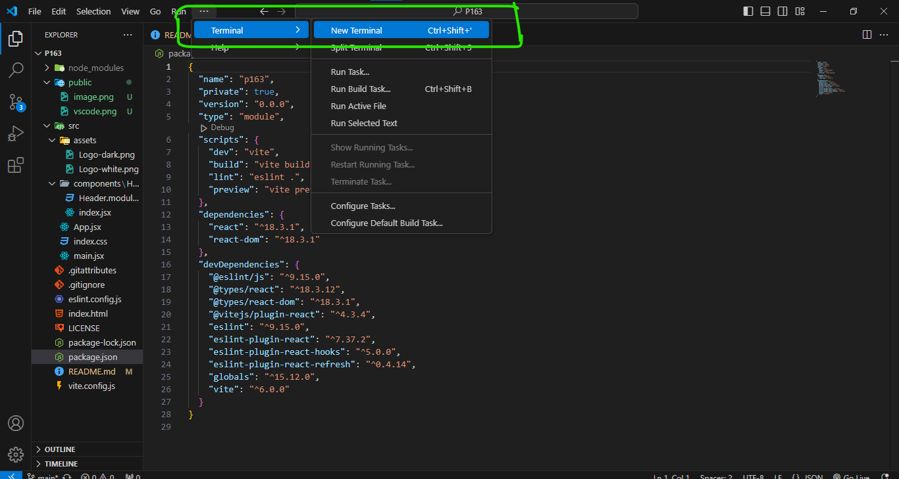

# P163
>"Consagrai ao Senhor tudo o que faz, e seus planos darão certo!" - Provérbios 16:3

<br>

***O P163 foi desenvolvido pensando em unir Talentos da área da programação a contratantes que buscam por um entusiasta dedicado e criativo. É aqui onde os desenvolvedores poderão publicar seus projetos mais impressionantes para que possam construir um portfólio admirável e que comprove suas habilidades de um verdadeiro programador!***

<br>

# Como instalar

### Antes de baixar o projeto, precisamos configurar o nosso ambiente de trabalho para que póssamos trabalhar em equipe:

1. Baixe e Instale o [GitHub Desktop](https://desktop.github.com/download/);
    1. Baixe o instalador, em seguida, execute-o;
    2. Instalação padrão, não é nescessário alterar nada;
2. Baixe e Instale o [Git](https://git-scm.com/downloads)
    1. Baixe o instalador, em seguida, **Execute-o como administrador**;
    2. Instalação padrão, não é nescessário alterar nada;
3. Faça login em sua conta no aplicativo do Github Desktop (com a mesma conta que está logado no projeto);

<br>

Agora, partimos para instalar o projeto de fato...

### Clone o repositório

No site do github, com o projeto aberto, você encontrará um botão verde, semelhante a este:


Clique nele e deve aparecer um dropdown, com algumas opções, clique em "Open With GitHub Desktop" e no aplicativo, clique em clonar repositório. Pronto, o projeto já está em sua máquina, agora vamos garantir que todas as dependências do projeto sejam instaladas.

<br>

Para isso, é muito simples, no Visual Studio Code, navegue até os 3 pontos e depois em "Terminal" > "New Terminal" ou simplesmente, em seu teclado pressione Ctrl + Shift + '



Após abrir o terminal, execute o comando responsável por instalar as dependências:

```
npm install
```

Este comando vai acessar o arquivo `package.json` onde está informações sobre quais dependências estão sendo utilizadas naquele projeto, e a versão de cada pacote, entre outras informações.

Quando finalizar, o ambiente estará pronto para o desenvolvimento, então, ainda no terminal, execute:

```
npm run dev
```

Este comando vai inicializar o servidor de desenvolvimento, para que você possa ver as atualizações em tempo real.

**Então, vamos entender como atualizar o código no github sem que haja problemas**

Sempre que for trabalhar no site, você deve primeiro verificar se algum colaborador não fez alguma alteração, para isso, abra o GitHub Desktop e você deve clicar no botã "Fetch Origin" no menu superior do aplicativo, isto irá fazer com que o github verifique se há alterações no repositório online.

Caso haja alterações, clique em "Pull". Que irá atualizar automaticamente o seu código local. Agora você pode trabalhar no projeto e, quando terminar, subir a atualização para o repositório online:

1. Salve todos os arquivos que vocÊ alterou enquanto trabalhava (dica: No VSCode, vá até o menu superior, clique em "File", ou "Arquivo" e Depois em "Auto Save" ou em "Salvar automaticamente", isso fará com que o vscode salve o arquivo sempre que você digitar)
2. Abra o GithHub Desktop e logo verá as alterações que fez;
3. Na área onde possui "Summary (required)", Adicione uma Descrição ao Commit, por exemplo: "Bug do Menu corrigido" ou "Página de Contato Finalizada";
4. Clique em "Commit to **main**"

---
<br>

Pronto, agora você faz parte da equipe P163!
### ***Seja Bem-vindo!***

<br>

### *Este projeto foi desenvolvido pela [Comunidade Dev.](https://discord.gg/96Xq4H6B) no Discord.
